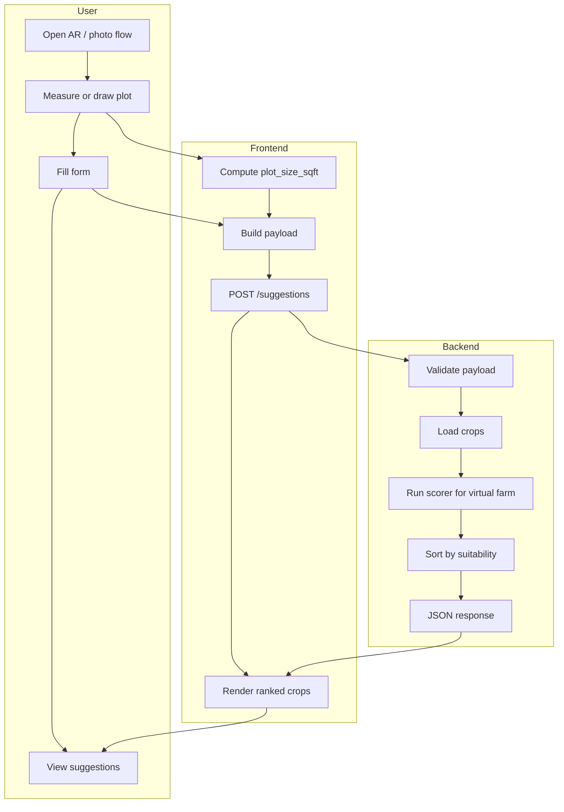
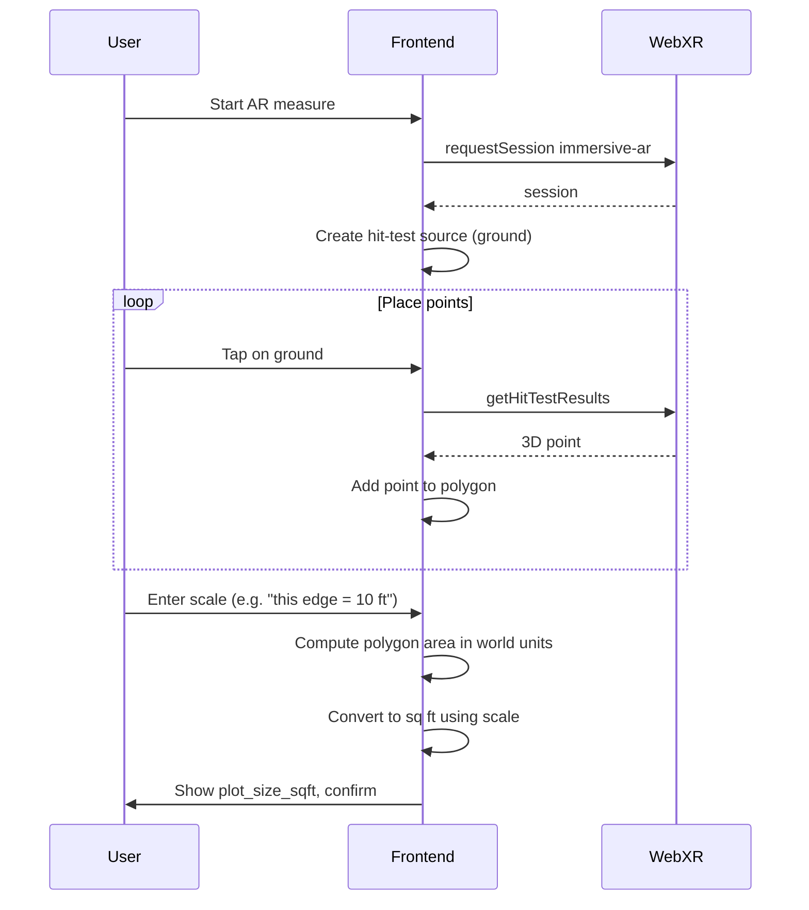
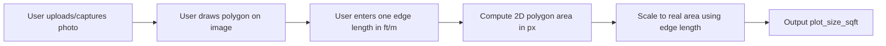
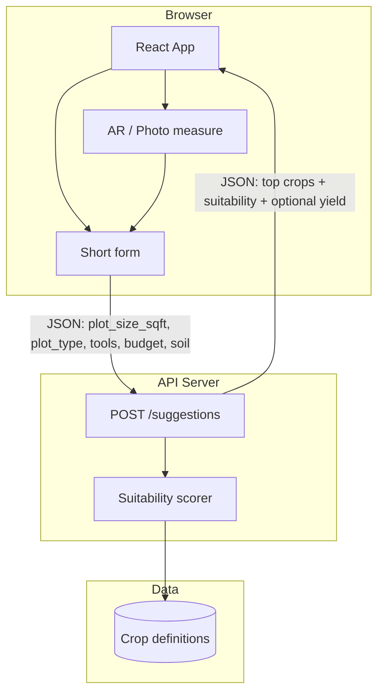

# AR Plot Scan — Full Plan, PRD, Workflow & Architecture

**Feature:** User scans their plot of land in the browser; the software returns ranked crop suggestions using the existing suitability engine.

---

## 1. Product Requirements Document (PRD)

### 1.1 Problem

Urban farmers often don’t know what to grow or how much space they have. Manual entry of plot size is error-prone; walking the perimeter with a tape measure is tedious. A low-friction way to capture plot area and get personalized crop suggestions increases onboarding and aligns with MyCelium’s “the network does the thinking” value.

### 1.2 Solution

An **AR-assisted plot scan** in the web app:

1. User measures their plot via **AR** (WebXR) or a **photo + outline** fallback.
2. The app derives **plot area (sq ft)** and optionally **plot type**.
3. User completes a **short form** (soil, tools, budget).
4. The **backend** runs the existing **suitability scorer** for this virtual farm against all crops.
5. User sees **ranked crop suggestions** (suitability scores and optional expected yield). They can later “Join network” to become a node and receive an official assignment.

### 1.3 User Stories

| ID | Story | Acceptance |
|----|--------|------------|
| U1 | As a new farmer, I can open the app and choose “Scan my plot” so that I don’t have to guess my plot size. | AR or photo flow is available from the main entry point. |
| U2 | As a user, I can measure my plot with my phone camera (AR) or by drawing on a photo so that I get an area in sq ft. | At least one of WebXR or photo+outline produces `plot_size_sqft`. |
| U3 | As a user, I can enter my soil conditions, tools, and budget so that suggestions match my situation. | Form collects plot_type, tools, budget, soil (pH, moisture, temp, humidity). |
| U4 | As a user, I see a ranked list of crops that fit my plot and conditions so that I know what to grow. | Response shows top N crops with suitability score (and optionally expected yield). |
| U5 | As a user on a device without AR support, I can still get suggestions by using the photo method or manual area entry. | Fallback path does not require WebXR. |

### 1.4 Requirements

**Functional**

- **FR-1** Backend exposes a **suggestions** endpoint that accepts one “virtual” farm (plot_size_sqft, plot_type, tools, budget, soil) and returns crops ranked by suitability.
- **FR-2** Suitability logic matches the existing network logic: hard gates (min_sqft, tools, budget) and weighted range scoring (pH, moisture, temp), then optional expected yield from `base_yield_per_sqft * suitability * plot_size_sqft`.
- **FR-3** Frontend provides an AR or photo-based flow that yields `plot_size_sqft` (and optionally plot_type), then a form for the remaining inputs, then calls the suggestions endpoint and displays results.
- **FR-4** If WebXR is unavailable or fails, a fallback (photo + outline + scale, or manual area) is available.

**Non-functional**

- **NFR-1** Suggestions response in under ~2s for typical payload.
- **NFR-2** Web AR works on supported browsers (e.g. Android Chrome with WebXR); no hard requirement for iOS WebXR in v1.
- **NFR-3** No auth required for the “preview” suggestions flow; “Join network” can be a separate, later step.

**Out of scope (this feature)**

- Creating or updating a real farm node in the network (that remains a separate onboarding flow).
- Running the full optimizer or assigning a single “official” crop; this is suggestions only.
- Native mobile app (iOS/Android); web only.
- Inferring soil or light from the scan (no computer vision beyond area/outline).
- Storing AR scans or photos in object storage (optional future enhancement).

---

## 2. Detailed Description

### 2.1 What the feature does

- **Input (from user):**
  - **Plot:** Area in sq ft from AR measurement or photo+outline (and optionally plot type: balcony / rooftop / backyard / community).
  - **Form:** Plot type (if not inferred), tools (basic / intermediate / advanced), budget (low / medium / high), soil: pH (0–14), moisture (0–100%), temperature (°C), humidity (0–100%).
  - **Optional:** Location (lat/lng) for future “join network” pre-fill.
- **Processing:** Backend loads crop definitions, runs suitability for this single “virtual” farm against every crop, and sorts by suitability (and optionally computes expected yield per crop).
- **Output (to user):** A ranked list of crops (e.g. top 10) with:
  - Crop name (and id)
  - Suitability score (0–1)
  - Optional: expected yield (kg) for the given plot size
  - Optional: short reason (e.g. “Good pH match” or “Fits your space”)

### 2.2 Suitability formula (unchanged)

From [MVP/01-network-logic.md](01-network-logic.md):

```
suitability(farm, crop) =
  w_ph      * range_score(farm.pH,          crop.optimal_pH)
+ w_moisture * range_score(farm.moisture,    crop.optimal_moisture)
+ w_temp    * range_score(farm.temp,         crop.optimal_temp)
+ w_size    * clamp(farm.sqft / crop.min_sqft, 0, 1)
+ w_tools   * (farm.tools >= crop.tool_requirement ? 1 : 0)
+ w_budget  * (farm.budget >= crop.budget_requirement ? 1 : 0)
```

Hard gates: if `farm.sqft < crop.min_sqft` or tools/budget below requirement, suitability = 0. Expected yield: `crop.base_yield_per_sqft * suitability(farm, crop) * farm.sqft`.

### 2.3 Crop schema (reference)

From [MVP/04-data-model.md](04-data-model.md): each crop has id, name, color, min_sqft, tool_requirement, budget_requirement, optimal_pH, optimal_moisture, optimal_temp, base_yield_per_sqft, grow_weeks, network_target_share. The suggestions endpoint reads this table (or seeded config) and does not modify it.

---

## 3. Workflow

### 3.1 User workflow

```
1. Open app → Choose "Scan my plot" (or "Get crop suggestions")
2. Choose method:
   a. AR measure (if supported) → Open camera → Place 3+ points on ground → Enter one real-world length for scale → Confirm area (sq ft)
   b. Photo + outline → Capture/upload photo → Draw polygon around plot → Enter one edge length (ft/m) → Confirm area (sq ft)
   c. Skip / manual → Enter plot area (sq ft) and plot type
3. Fill short form: plot type, tools, budget, soil (pH, moisture, temp, humidity)
4. Submit → Loading state
5. View results: ranked list of crops with suitability (and optional yield)
6. Optional: "Join network" → redirect to full onboarding (creates node, then optimizer can assign)
```

### 3.2 System workflow (data flow)



### 3.3 AR measurement workflow (WebXR path)



### 3.4 Photo fallback workflow



---

## 4. Architecture

### 4.1 High-level architecture



### 4.2 Frontend

| Layer | Responsibility | Tech |
|-------|----------------|------|
| Entry | Route or CTA to “Scan my plot” / “Get suggestions” | React router or main dashboard |
| AR / Measure | WebXR session, hit-test, place points, compute area from polygon + scale; or photo upload, canvas polygon, scale input, area computation | WebXR Device API, Canvas 2D, optional file input |
| Form | Collect plot_type, tools, budget, soil (pH, moisture, temp, humidity); validate; build request body | React components, controlled inputs |
| API | POST to `/suggestions` with virtual farm payload; handle loading and errors | fetch or axios |
| Results | Display ranked list (name, suitability, optional yield); optional “Join network” CTA | React list/cards |

**Placement:** Under [app/frontend/](app/frontend/) (React app). New components: e.g. `ARPlotMeasure`, `SuggestionsForm`, `SuggestionsResult`. Feature-detect WebXR and offer AR vs photo vs manual.

### 4.3 Backend

| Component | Responsibility | Notes |
|-----------|----------------|-------|
| **POST /suggestions** | Accept JSON body; validate; call scorer; return top N crops with scores (and optional yield) | No auth for preview; rate-limit if needed |
| **Scorer** | Single-farm suitability: for one farm struct and crop list, return suitability per crop (and optionally yield). Apply hard gates and weighted range_score. | Reuse formula from [MVP/01-network-logic.md](01-network-logic.md); no optimizer, no DB write |
| **Crop definitions** | Read-only. Seed data or table (e.g. crops in Postgres/Supabase). | Same schema as rest of MyCelium |

**API contract (example)**

- **Request:** `POST /suggestions`  
  Body: `{ plot_size_sqft, plot_type, tools, budget, soil: { pH, moisture, temperature, humidity }, location?: { lat, lng } }`
- **Response:** `200`  
  Body: `{ crops: [ { id, name, color, suitability, expected_yield_kg? }, ... ] }`  
  Sorted by `suitability` descending. Optional: `reason` or `eligible: boolean` per crop.

### 4.4 Data flow summary

| Step | Data | Direction |
|------|------|-----------|
| 1 | plot_size_sqft (and optionally plot_type) | AR/photo → frontend state |
| 2 | plot_type, tools, budget, soil | Form → frontend state |
| 3 | Full virtual farm payload | Frontend → POST /suggestions |
| 4 | Crop list (from DB or config) | Backend → scorer |
| 5 | Suitability vector (per crop) | Scorer → endpoint |
| 6 | Top N crops + scores (and optional yield) | Backend → frontend |
| 7 | Rendered list | Frontend → user |

No new tables; suggestions are stateless. Optional: log requests for analytics (no PII required for suggestions).

### 4.5 Scale and WebXR

- **Scale for AR:** User must supply a real-world length (e.g. “this edge is 10 ft”) so the polygon area (in world units) can be converted to sq ft. No fiducial markers in MVP.
- **WebXR support:** Primarily Android Chrome; Safari/Desktop support is limited. Use `navigator.xr` and fall back to photo+outline or manual entry when unavailable.

---

## 5. Full plan (build order)

| Phase | Task | Deliverable |
|-------|------|-------------|
| **1** | Backend: crop definitions (seed or table) | Crops loadable by scorer |
| **2** | Backend: scorer module (single farm, all crops, suitability + optional yield) | Function: `suggestions(farm) -> list[crop_score]` |
| **3** | Backend: POST /suggestions endpoint | API contract implemented |
| **4** | Frontend: React app shell (if missing), route/CTA for “Get suggestions” | Entry point to flow |
| **5** | Frontend: Short form (plot_type, tools, budget, soil) + API call + suggestions result view | End-to-end test with manual plot_size_sqft |
| **6** | Frontend: Photo+outline flow (upload, draw polygon, scale input, area computation) | Fallback measure path |
| **7** | Frontend: WebXR AR flow (session, hit-test, place points, scale input, area computation) | Primary measure path where supported |
| **8** | Docs and polish: Update PRD/04 open questions; optional architecture blurb in MVP/05 | AR suggestions marked in scope and described |

---

## 6. References

- [MVP/00-mvp-overview.md](00-mvp-overview.md) — MVP scope and stack
- [MVP/01-network-logic.md](01-network-logic.md) — Suitability formula and system inputs
- [MVP/04-data-model.md](04-data-model.md) — FarmNode and Crop schemas
- [MVP/05-architecture.md](05-architecture.md) — System architecture
- [PRD/04-open-questions.md](../PRD/04-open-questions.md) — Farm kit tiers (AR plot mapping)
