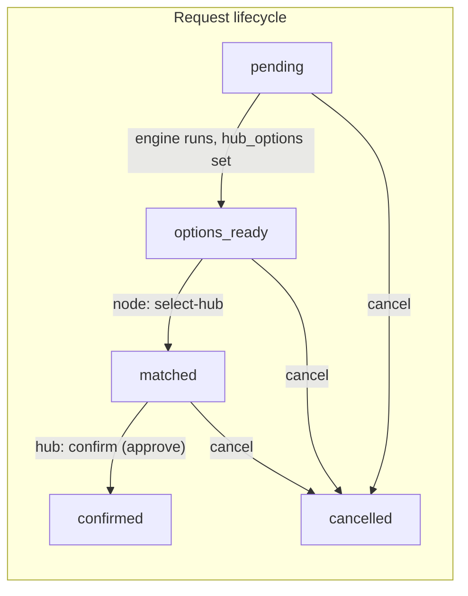

# MyHub Admin — Approve or Reject User Requests

## Goal

**MyHub admins are hub people.** They act on behalf of a specific hub. From the admin UI they can **approve** or **reject** only the transactions that are happening **at their own hub**.

- **Approve** — Hub confirms the physical exchange at their hub; request moves to `confirmed`, ledger and inventory update.
- **Reject** — Hub rejects the transaction at their hub (e.g. user no-show, dispute); request is cancelled so it does not complete at this hub.

Admins do not see or act on requests at other hubs; everything is scoped to the hub they represent.

---

## Hub-scoped admin

- **Who is the admin:** A person acting as staff for **one hub** (e.g. “Greenwood PS” or “North Community”). In the UI they either select their hub (e.g. dropdown) or are assigned to it by future login/auth.
- **What they see:** Only requests where the request is tied to **their hub**:
  - **Matched** requests with `hub_id === myHubId` — these are transactions that will happen at (or already assigned to) their hub; these are the ones they can approve or reject.
  - Optionally **options_ready** requests that include their hub in `hub_options` — for context (e.g. “incoming soon”); they cannot approve until the node selects this hub (then it becomes matched).
- **What they can do:**
  - **Approve** — Only for **matched** requests at their hub. Same as hub confirmation: submit actual quantity, call confirm API.
  - **Reject** — For **matched** (or optionally **options_ready** if they can cancel on behalf of their hub) requests at their hub. Request is cancelled so the transaction does not happen at this hub. MVP: use existing cancel (`DELETE /requests/{id}`); later you can add a distinct “rejected_by_hub” status or reason if needed.

All listing and actions in the MyHub admin UI must be filtered by **current hub** so admins only ever see and act on their own hub’s transactions.

---

## Current request lifecycle (backend)

- **pending** — User submitted; engine has not yet assigned hub options.
- **options_ready** — Engine assigned `hub_options`; node must call `POST /requests/{id}/select-hub` to pick a hub.
- **matched** — Node chose a hub; waiting for **hub confirmation** (physical exchange).
- **confirmed** — Hub confirmed; ledger updated, inventory and balances updated.
- **cancelled** — Request cancelled (node or admin).

Only requests in **matched** can be confirmed. The backend endpoint that performs “approval” is:

- **`POST /requests/{request_id}/confirm`**  
  Body: `{ "actual_quantity_kg": number }`  
  Moves request to `confirmed`, updates hub inventory, node balance, and appends a ledger entry.

---

## How admin approve/reject fits in

**Admins are hub people:** they only see and act on requests at **their hub**.

1. **Hub context**  
   The UI must have a notion of “current hub” (e.g. hub selector dropdown, or from future auth). All lists and actions use `hub_id = currentHubId`.

2. **Which requests they see**  
   - **Matched** requests with `request.hub_id === currentHubId` — these are transactions at their hub; show **Approve** and **Reject**.
   - Optionally show **options_ready** requests where their hub is in `hub_options` (for “incoming” context); no approve until the node selects this hub.

3. **Approve (hub confirms)**  
   - Only for **matched** requests at their hub.  
   - Admin clicks **Approve** → modal: “Actual quantity (kg)” (default = request’s `quantity_kg`) → Submit → `POST /requests/{id}/confirm` with `{ actual_quantity_kg }`.  
   - On success: request becomes `confirmed`; refresh list and ledger.

4. **Reject (hub rejects at their hub)**  
   - For **matched** (and optionally **options_ready**) requests at their hub.  
   - Admin clicks **Reject** → optional reason (future) → request is cancelled so the transaction does not complete at this hub.  
   - MVP: call existing `DELETE /requests/{id}` (status → `cancelled`). No new backend. Later: optional “rejected_by_hub” status or reject reason.

---

## UI placement and flow

- **Where:** MyHub Admin — **Transactions** tab (same view as the existing “01 — Full Dashboard Shell — MyHub Transactions Tab” plan).
- **Hub selector (required)**  
  At the top of the MyHub view (or in the topbar), the admin selects **their hub** (e.g. dropdown of hubs from `GET /hubs`). All data and actions below are scoped to this hub. If the app later has auth, the current hub can be fixed by role instead of a selector.
- **What to add:**
  - **Transactions at my hub**  
    List requests where `hub_id === currentHubId` (for **matched**) or where current hub is in `hub_options` (for **options_ready**, optional). Clearly label that this is “Transactions at [Hub name]”.
  - **Per-row actions for matched requests at their hub:**
    - **Approve** → modal: “Actual quantity (kg)” (default = `quantity_kg`), **Confirm** / **Cancel**. On Confirm, call `confirmRequest(requestId, actualQuantityKg)`; refresh.
    - **Reject** → confirm “Reject this transaction at your hub?” → call `DELETE /requests/{id}` (or future reject endpoint); refresh.
  - **Secondary filter**  
    Keep status filters (All / Pending / Settled etc.); “Pending” = requests at their hub that are `matched` (and optionally `options_ready`) so “Pending” = “awaiting my approval”.

---

## Data and API usage

| Action              | API                                       | When                                  |
|---------------------|-------------------------------------------|----------------------------------------|
| List hubs           | `GET /hubs`                               | Populate hub selector                  |
| List at my hub      | `GET /requests?hub_id={currentHubId}`     | Optional `&status=matched` for focus |
| Approve              | `POST /requests/{id}/confirm`             | Admin submits actual quantity          |
| Reject               | `DELETE /requests/{id}`                   | Hub rejects transaction at their hub  |

- **Hub scope:** Always pass `hub_id` when listing so the admin only sees requests at their hub. Backend already supports `GET /requests?hub_id=X`.
- Frontend: `listRequests({ hub_id: currentHubId, status: "matched" })` for “awaiting my approval”; `confirmRequest(id, actual_quantity_kg)` for approve; add `cancelRequest(id)` if not present, used for Reject.
- No new backend endpoints; reuse confirm and cancel (reject = cancel).

---

## Implementation checklist

1. **Hub selector**
   - Fetch hubs with `getHubs()`; show a **Hub** dropdown (or similar) at the top of the MyHub Transactions view.
   - Store **current hub** in state (e.g. `selectedHubId`). All requests list and actions use this hub.

2. **Transactions at my hub**
   - Fetch requests with `listRequests({ hub_id: selectedHubId })` (optionally `status: "matched"` for “awaiting approval” view).
   - Render table: ID, Node, Type, Crop, Qty, Hub, Status, **Actions**.
   - Only show **Approve** and **Reject** for requests that are **matched** and `request.hub_id === selectedHubId`.

3. **Approve flow**
   - **Approve** → modal: “Actual quantity (kg)” (default = request’s `quantity_kg`), **Confirm** / **Cancel**.
   - On Confirm: `confirmRequest(requestId, actualQuantityKg)`; on success close modal and refetch; on error show message.

4. **Reject flow**
   - **Reject** → confirmation: “Reject this transaction at your hub?” → call `cancelRequest(requestId)` (i.e. `DELETE /requests/{id}`); refetch. Add `cancelRequest(id)` to the API client if missing.

5. **Copy and UX**
   - Label the view as transactions “at [Hub name]”. Use “Approve” and “Reject” so it’s clear the hub is accepting or refusing the transaction at their location.

6. **Errors**
   - Handle 400 and 404; show user-friendly message and refresh list.

---

## Optional: admin select-hub (future)

For **options_ready** requests that include their hub in `hub_options`, the hub admin could “accept” by calling `POST /requests/{id}/select-hub` with their `hub_id`, so the request becomes **matched** at their hub. Then they can **Approve** or **Reject** as above. No backend change; only UI and existing `selectHub(requestId, hub_id)`.

---

## Summary

| Item                    | Approach                                                                 |
|-------------------------|--------------------------------------------------------------------------|
| Who is the admin        | Hub people; they act for **one hub** (selected in UI or from auth)       |
| Scope                   | Only requests **at their hub** (`hub_id === currentHubId`)               |
| Approve                 | Hub confirms physical exchange = `POST /requests/{id}/confirm`            |
| Reject                  | Hub rejects at their hub = `DELETE /requests/{id}` (cancel)              |
| Where in UI             | MyHub Admin → Transactions tab; hub selector; actions on matched at hub   |
| Backend                 | No new endpoints; use existing confirm and cancel                         |

This plan can be implemented on top of the existing “MyHub Admin Transactions + Currency Ledger” plan by adding the hub selector, hub-scoped request list, and Approve/Reject actions to the Transaction History view.
